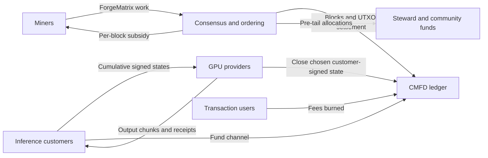
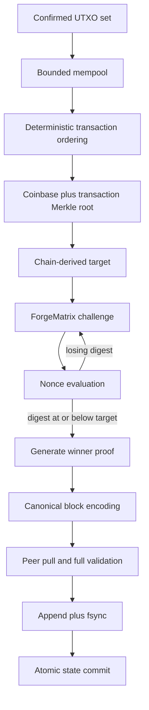
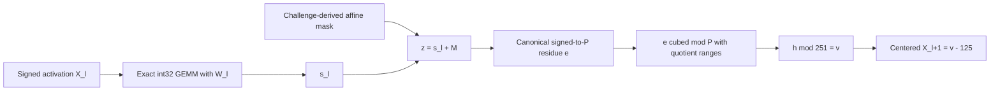
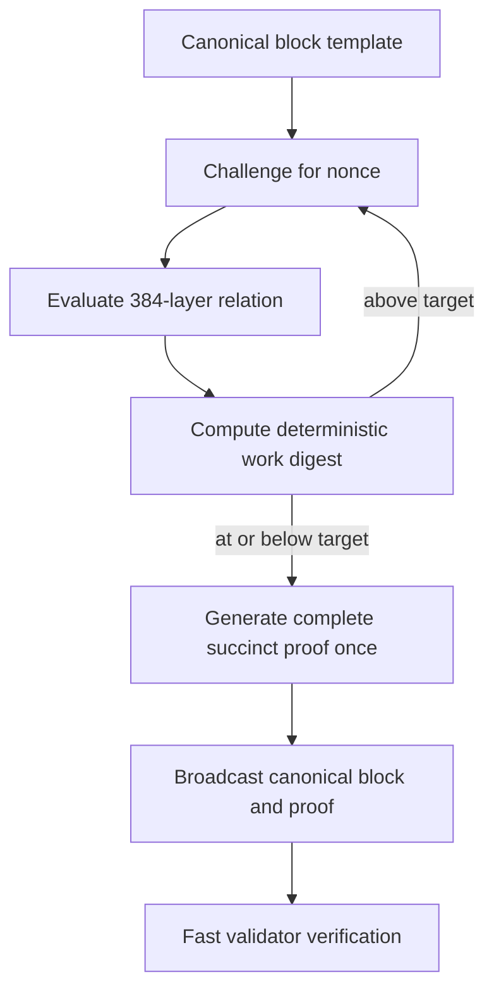
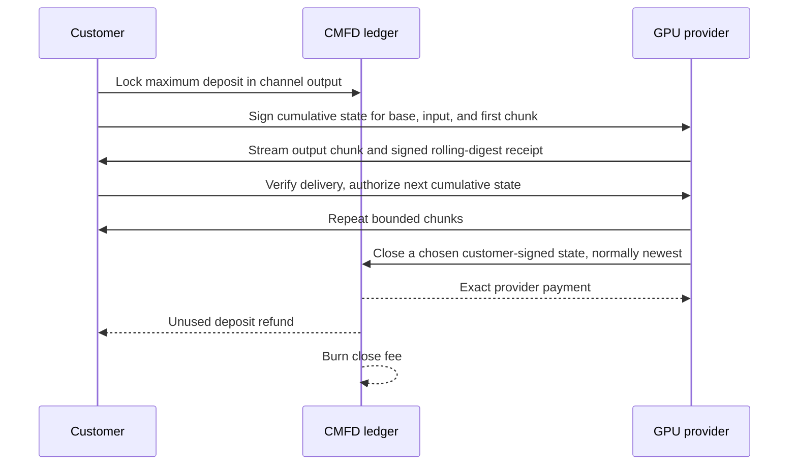

# Common Foundry

## Matrix-Bound Proof of Work and Direct GPU Inference Markets

Technical White Paper - Devnet-0 and ForgeMatrix v2 Research Architecture

Version 0.1 - August 2026

Common Foundry Research

> **Status: research protocol - not mainnet.** Common Foundry Devnet-0 is a private, valueless test network. It implements canonical ledger rules, exact tiny-profile ForgeMatrix v2 replay, multi-node synchronization, fork choice, fee burning, inference-channel settlement accounting, and a pinned-TLS pool test protocol with volatile session counters. The proposed production ForgeMatrix profile and succinct proof system are hard-disabled. They require cryptographic implementation, benchmark evidence, independent implementations, public adversarial testing, and two external audits before any public-value activation.

---

## Abstract

Common Foundry is a research architecture for a proposed permissionless proof-of-work ledger that coordinates GPU computation. It separates two activities that are often conflated in claims about "useful proof of work." First, a deterministic, public, matrix-heavy function called ForgeMatrix orders blocks and secures settlement. Second, the proposed market would let customers purchase actual inference directly from GPU providers through prepaid, progressively authorized payment channels denominated in CMFD. The mining function is not customer inference, and an inference receipt is not a proof that a model answer is correct. This separation is intentional: consensus must remain deterministic, self-contained, and independently verifiable, while commercial inference is heterogeneous, latency-sensitive, and frequently private.

ForgeMatrix v2 is designed around signed INT8 by signed INT8 matrix multiplication with exact INT32 accumulation over a seedless committed 6 GiB weight bank. Its proposed production profile evaluates 384 sequential 4096 by 4096 layers over a batch of 128 rows, totaling 824,633,720,832 multiply-accumulate operations per nonce. A block-specific affine mask and a range-bound cubic transition over the prime 134,217,689 prevent the earlier small-modulus accumulator shortcut. The intended verifier is a non-zero-knowledge GKR/sumcheck protocol backed by a transparent multilinear polynomial commitment scheme. The proof must bind every layer, exact integer ranges, the model artifact, the block challenge, the winning nonce, the target, and the final activation digest.

The current software does not yet contain that production proof. Devnet-0 deliberately uses a tiny 2 by 4 by 4 profile and validates it by full recomputation. This paper therefore distinguishes three states throughout: **implemented**, **Devnet reference**, and **production proposal**. It also states a fundamental limitation: software consensus can prove evaluation of a committed arithmetic relation, but cannot prove which physical processor ran it or that bytes resided in GPU VRAM.

The monetary policy has a five-year, per-block linear bootstrap emission followed by a permanent 5 CMFD miner tail. Before the tail, each subsidy is split approximately 70% to miners, 25% to a steward destination, and 5% to a community destination. All transaction and inference-channel close fees are burned. The steward and community outputs are transparent and immediately spendable on a per-block basis; if both remain under founder control, they are economically a disclosed nominal 30% founder-controlled pre-tail stream, not a decentralized treasury.

The objective is not to declare the design production-ready. It is to make the research claim precise, executable, falsifiable, and governed by measurable activation gates.

## 1. Status vocabulary and scope

This paper uses the following labels as protocol terms:

| Label | Meaning |
|---|---|
| **Implemented** | Enforced by the current Rust consensus or node code and covered by executable tests. |
| **Devnet reference** | Operational on the private, valueless Devnet, but intentionally tiny, slow, insecure for custody, or unsuitable for public adversaries. |
| **Production proposal** | Specified research design that is not accepted by current consensus and must not be represented as deployed. |
| **Activation gate** | A measurable requirement that must be met before a production profile can be enabled. |

This revision describes the `v0.1.0-devnet.10` research prerelease; its annotated release tag identifies the exact source commit. Devnet-0 uses a tiny ForgeMatrix v2 descriptor with batch 2, dimension 4, and 4 layers. Its 177-byte proof payload, or 193 bytes as a standalone framed proof, is a serialized claim rather than a succinct cryptographic proof: validators recompute the entire tiny relation from the pinned model. The candidate production descriptor with batch 128, dimension 4096, and 384 layers is rejected by code.

This white paper describes the intended system, the rationale behind its choices, the exact consensus relations already specified, and the unresolved work. It does not offer CMFD for sale, promise financial returns, or assert that the current network is safe for real value.

## 2. Why Common Foundry is needed

### 2.1 Three coordination problems

Modern GPU operators face three distinct coordination problems:

1. **Permissionless settlement needs an objective ordering rule.** A ledger needs a public predicate that every validator can evaluate identically without relying on a customer, cloud provider, model vendor, or external oracle.
2. **Inference providers need low-friction incremental payment.** Model execution is often streamed, usage-metered, and too granular for an on-chain transaction per token chunk. Neither party should need to extend unlimited credit.
3. **A new protocol needs visible, continuing infrastructure funding.** Engineering, audits, ecosystem tools, and operator support require resources, but hidden premines and discretionary inflation weaken credibility.

Many "useful work" proposals try to solve all three with one mechanism: make arbitrary customer jobs determine block validity. That creates hard consensus dependencies. Customer models can be unavailable or proprietary. Inputs can be private. GPU kernels can be nondeterministic. Different runtimes may disagree. A task can have commercial value while being difficult to verify more cheaply than repeating it. Demand arrives irregularly, while block production must continue on schedule.

Common Foundry therefore separates the responsibilities.



### 2.2 The central thesis

Common Foundry is a research-first attempt to align permissionless monetary security, GPU matrix computation, direct inference payments, and transparent public-goods funding without pretending that consensus can prove which physical device or memory tier performed the work.

The intended alignment is economic rather than magical:

- ForgeMatrix makes large exact matrix multiplication the dominant candidate cost.
- That work favors hardware and operational skills also useful for machine learning.
- The same operators may separately sell inference.
- The chain supplies neutral asset settlement and bounded-exposure channels.
- Public-goods allocations are explicit in every pre-tail coinbase instead of hidden in a premine.

The design does **not** assert that a mined block performed a customer's useful inference. It also does not require inference demand for liveness. If no customer jobs exist, consensus can still advance. If a marketplace runtime fails, ledger verification remains self-contained.

### 2.3 Why not a conventional hash loop?

A conventional hash-based proof of work is compact, mature, and easy to verify. ForgeMatrix deliberately accepts greater implementation complexity in pursuit of a different hardware-cost shape: a large public data set, repeated dense matrix reuse, exact arithmetic, and sequential nonlinear transitions.

The hoped-for benefit is a mining ecosystem closer to commodity ML acceleration than a narrow hash-only pipeline. The cost is substantial: consensus needs a sound succinct proof, a fixed model artifact, exact cross-platform semantics, stronger parser defenses, and evidence that the intended resident execution is actually economically dominant. Until those gates are satisfied, a conventional hash loop remains the lower-risk engineering choice. The project treats this as an empirical hypothesis, not a foregone conclusion.

## 3. System architecture

Common Foundry consists of four layers:

1. **Consensus library.** Canonical transactions and blocks, UTXO state transitions, reward allocation, fee burning, difficulty, proof selection, and wire encoding.
2. **ForgeMatrix proof-of-work.** A public, block-bound computation and its proposed succinct proof.
3. **Inference payment protocol.** Signed cumulative customer authorizations, provider receipts, and on-chain settlement or refund.
4. **Node and wallet runtime.** Static private peer synchronization, forks, persistence, mempool, mining templates, loopback RPC, a CMFD-specific Devnet pool service, and a Devnet wallet interface.

The crates separate responsibilities for review. Consensus explicitly imports the marketplace types and rules that govern channel spends, while the node consumes canonical consensus objects; this is an audit boundary, not cryptographic or dependency isolation. Any marketplace function reached from consensus is consensus-critical and must be versioned, reviewed, and tested with the same discipline as the ledger rules.

### 3.1 End-to-end block path



The block challenge includes the network, model, parent, transaction root, height, timestamp, target, and nonce. A miner cannot change the reward outputs or ordinary transactions after finding work because the coinbase commitment and transaction identifiers are included in the Merkle root.

## 4. Ledger and consensus core

### 4.1 UTXO state

Common Foundry uses an unspent transaction output model. Each input names a prior transaction identifier and output index. Ordinary key-locked outputs are controlled by a 32-byte x-only secp256k1 public key and a 64-byte Schnorr signature. Inference-channel outputs use a distinct structured lock enforced by consensus.

Every transaction commits to the full 32-byte network identifier. Signatures and identifiers use domain-separated hashing so an object valid on one network cannot be replayed on another network with merely a colliding four-byte wire magic.

Validation enforces:

- the expected transaction and block versions;
- exact network identity;
- canonical bounded encoding;
- unique inputs and available UTXOs;
- signature validity and lock semantics;
- coinbase maturity;
- nonzero outputs and no value creation;
- transaction, input, output, byte, and signature-count caps;
- exact channel settlement or timeout-refund accounting.

### 4.2 Coinbase and maturity

Every pre-tail block creates exactly three consensus outputs:

1. the miner reward;
2. the steward award;
3. the community award.

The miner output matures after 100 blocks. Steward and community outputs are marked spendable at their creation height; because transactions are validated before the current block's coinbase is inserted, they can first be consumed by a later block. There is no 90-day delay.

The destinations and reward rules are immutable network parameters committed into the consensus fingerprint. A node cannot accept a different community key, monetary schedule, proof profile, or resource limit while claiming compatibility with the same fingerprint.

### 4.3 Canonical wire format

Top-level transactions, proofs, and blocks use a fixed 16-byte frame header:

```text
offset  size  field
0       4     ASCII "CMFD"
4       4     network-derived magic
8       2     little-endian wire version
10      1     object kind
11      1     flags, currently zero
12      4     little-endian payload length
```

The decoder rejects unknown tags or kinds, nonzero flags, excessive counts or lengths, truncation, malformed fixed-width fields, noncanonical nested encodings, and trailing bytes. Consensus validation separately rejects duplicate transaction inputs and duplicate or retired channel identifiers. Current upper bounds are:

| Resource | Bound |
|---|---:|
| Block frame | 1 MiB |
| Transaction frame | 64 KiB |
| Proof frame | 256 KiB |
| Transactions per block | 1,024 |
| Inputs per transaction | 128 |
| Outputs per transaction | 128 |
| Aggregate regular inputs per block | 4,096 |
| Aggregate regular outputs per block | 4,096 |
| Signature checks per block | 2,048 |
| Coinbase outputs | 3 |

These are consensus and parser-safety choices, not throughput claims. Fixed-width little-endian fields and explicit count caps were chosen over general-purpose serialization because consensus must reject ambiguous representations and allocate only after checking declared sizes.

### 4.4 Difficulty adjustment

The target interval is 60 seconds. The next target uses at most the most recent 180 header-work records. Let `Nw` be the number of records in the window, `T_i` the encoded targets, and `t_i` the effective timestamps. For `Nw > 1`:

```text
average_target = floor(sum(T_i) / Nw)
expected_span  = (Nw - 1) * 60
actual_span    = clamp(t_last - t_first,
                       expected_span / 3,
                       3 * expected_span)
next_target    = min(pow_limit,
                     max(1,
                         floor(average_target * actual_span /
                               expected_span)))
```

The block must carry exactly this independently derived target before proof verification. Arithmetic uses checked 256- and 512-bit integers.

Raw timestamps must exceed the median of the preceding 11 timestamps and must not be more than 24 hours beyond the validating node's locally supplied acceptance time. Effective median timestamps, rather than raw miner timestamps, enter the retarget history. This reduces timestamp manipulation, although it still requires reasonably synchronized operator clocks.

### 4.5 Chainwork and fork choice

The work assigned to a target `T` is:

```text
work(T) = floor(2^256 / (T + 1))
```

Cumulative work is stored in 512 bits. A side branch activates only when its fully validated cumulative work is **strictly greater** than the active branch. Equal-work branches retain the existing active tip. There is no finality rule; the system inherits Nakamoto-style majority-work assumptions and reorganization risk.

## 5. Monetary policy and funding

### 5.1 Units and five-year bootstrap

One CMFD contains 100,000,000 atomic units. With a nominal 60-second block target, five 365-day years contain:

```text
N = 5 * 365 * 24 * 60 = 2,628,000 blocks
```

The initial subsidy is 500 CMFD. For real block height `h`, where `1 <= h <= N`:

```text
R(h) = floor(50,000,000,000 * (N - h + 1) / N) atoms
```

At height `N + 1` and thereafter, the subsidy is a permanent miner-only 5 CMFD tail.

| Height | Total subsidy | Miner | Steward | Community |
|---:|---:|---:|---:|---:|
| 1 | 500.00000000 | 350.00000000 | 125.00000000 | 25.00000000 |
| 525,600 | 400.00019025 | 280.00013318 | 100.00004756 | 20.00000951 |
| 1,314,000 | 250.00019025 | 175.00013318 | 62.50004756 | 12.50000951 |
| 2,628,000 | 0.00019025 | 0.00013318 | 0.00004756 | 0.00000951 |
| 2,628,001 | 5.00000000 | 5.00000000 | 0 | 0 |

The change from 0.00019025 to 5 CMFD is an intentional discontinuity. It is not a rounding accident.

<!-- PDF_FIGURE:emission -->

### 5.2 Per-block allocation

Before the tail:

```text
steward   = floor(R(h) * 25 / 100)
community = floor(R(h) *  5 / 100)
miner     = R(h) - steward - community
```

Rounding remainder belongs to the miner so the three outputs sum exactly to the scheduled subsidy. Once the tail begins, the entire 5 CMFD goes to the miner and both public-goods streams stop.

The exact aggregate pre-tail issuance is:

```text
E_pre = sum from k=1 to N of floor(R0 * k / N)

      = (R0*N + R0 - N + gcd(R0,N)) / 2

      = 65,700,024,998,688,000 atoms
      = 657,000,249.98688000 CMFD
```

Its implemented aggregate distribution is:

| Recipient | Pre-tail CMFD |
|---|---:|
| Miners | 459,900,175.01312000 |
| Steward | 164,250,062.48688000 |
| Community | 32,850,012.48688000 |
| Steward plus community | 197,100,074.97376000 |
| Total | 657,000,249.98688000 |

There is no finite maximum supply. At height `H >= N + 1`:

```text
gross_issuance(H)
  = 657,000,249.98688
    + 5 * (H - 2,628,000) CMFD
```

At target spacing the tail adds 2,628,000 CMFD per 365-day year. The first tail year's gross inflation is about 0.4% of pre-tail issuance and declines proportionally as the base grows. Protocol-tracked unburned supply equals gross issuance minus burned fees. Outputs controlled by lost keys remain outstanding in ledger accounting even though they are economically inaccessible.

### 5.3 Why a linear decline?

A linear per-block decline avoids discrete halving cliffs. It makes the schedule transparent at every height and reduces recurring moments where miner revenue changes abruptly by 50%. Height, rather than timestamp, controls the reward, so miners cannot directly accelerate issuance by selecting timestamps.

The tradeoff is front-loading: the five-year bootstrap allocates a large share early. Calendar completion is nominal, not guaranteed, because five years assumes the observed average remains near one block per minute.

### 5.4 Why a permanent tail?

All fees are burned, so long-run miner security cannot rely on fee revenue. A permanent tail provides a predictable security budget and avoids assuming that a transaction-fee market alone will sustain proof of work.

The current boundary is deliberately exposed as an experiment. Total subsidy jumps by roughly 26,281 times from the final declining block to the first tail block; miner subsidy jumps by roughly 37,543 times. Immediately before the boundary, miner compensation is extremely small. Testnet modeling must determine whether late-bootstrap hash security and the abrupt reset are acceptable. A smoother floor or earlier tail transition would reduce the discontinuity but would change the requested policy and issuance totals.

### 5.5 Why burn every fee?

For an ordinary transaction:

```text
fee_burned = sum(input values) - sum(output values)
```

No output pays that difference to a miner. Inference-channel closure similarly burns its exact close fee. The coinbase is validated solely against scheduled emission.

The reasons are:

- transaction demand cannot become an unauthorized second coinbase stream;
- congestion is not directly paid to the miner who can order it;
- usage offsets some permanent tail issuance;
- the scarcity effect accrues generally rather than only to the winning miner.

The tradeoff is equally important: miners have no marginal fee incentive to include transactions. The Devnet relay floor of one atom per started KiB limits trivial local spam but is not a consensus fee market. A directly mined zero-fee transaction remains valid. Production must study inclusion incentives, congestion, and mempool eviction rather than assuming fee burning solves them.

### 5.6 Steward and community control

Per-block awards avoid an up-front premine and make the distribution visible in every block. They decline with issuance and terminate at the tail. Immediate spendability allows continuous engineering and ecosystem operations.

Labels do not determine control. If a founder controls both fixed destinations, the system economically grants that founder control over a nominal 30% pre-tail stream totaling 197,100,074.97376000 CMFD. Current Devnet keys are deterministic and public, not secure treasury keys. There is presently no multisignature treasury, on-chain vote, vesting, spending-purpose restriction, recipient rotation, or reporting mechanism.

Before any public-value network, the project must publish the beneficial owners, key custody, signer threshold, conflicts policy, permitted uses, reporting cadence, and a credible change process. A "community fund" should be evaluated by who can spend it and under what accountability, not by its name.

## 6. ForgeMatrix: design goals and evolution

### 6.1 What the proof of work can establish

ForgeMatrix seeks to make exact dense integer matrix multiplication the dominant cost of evaluating a nonce. A valid block should establish that the miner evaluated the exact committed function for the exact block challenge and found a resulting digest at or below the chain-derived target.

It cannot establish:

- that a GPU was used;
- that the complete bank physically resided in VRAM;
- that a particular instruction sequence or kernel ran;
- that no CPU, FPGA, ASIC, compression scheme, or algebraically equivalent implementation exists;
- that the computation answered a customer inference request.

These are fundamental limits of ordinary software consensus. The protocol can make a resident GPU path economically favorable and measure that advantage, but cannot convert an economic performance claim into a physical proof.

### 6.2 Why v1 was insufficient

ForgeMatrix v1 remains useful as an exact full-recomputation oracle. It is not a production candidate for two central reasons.

First, its model can be expanded from a 32-byte seed. That gives every miner a consensus-approved regeneration path instead of forcing access to the intended byte bank. A large nominal model size is irrelevant if the canonical description is tiny.

Second, an earlier transition reduced the dot product into a small modulus before the final output. A miner could evaluate losing nonces with modular accumulators and reconstruct exact witnesses only for a winner. Consensus cannot force a miner to use an unnecessarily expensive instruction sequence when a cheaper equivalent computes the same function.

V2 responds by committing actual seedless bytes and by making the full signed dot-product interval uniquely recoverable from a canonical residue under a larger prime.

## 7. ForgeMatrix v2 exact relation

### 7.1 Proposed production parameters

| Parameter | Value |
|---|---:|
| Batch rows `B` | 128 |
| Matrix dimension `D` | 4,096 |
| Sequential layers `L` | 384 |
| Layer banks | 3 banks of 128 |
| Raw byte alphabet | 0 through 250 |
| Centered value | raw byte minus 125 |
| Transition prime `P` | 134,217,689 |
| Output alphabet modulus | 251 |
| Proof base field | Goldilocks, `2^64 - 2^32 + 1` |
| Fiat-Shamir challenge space | at least 192 bits |

The weight bank contains:

```text
L * D * D
= 384 * 4096 * 4096
= 6,442,450,944 bytes
= exactly 6 GiB
```

The base table adds `B * D = 524,288` bytes. One nonce performs:

```text
L * B * D * D
= 384 * 128 * 4096 * 4096
= 824,633,720,832 multiply-accumulate operations
```

The virtual input and 384 real layers perform 201,850,880 cubic output reductions.

### 7.2 Seedless model bank and dual commitment

The canonical artifact has a fixed 184-byte header followed by the row-major base table and row-major matrices `W_0` through `W_383`, with no trailing bytes. Every payload byte must lie in `0..250`; values `251..255` are invalid.

```text
header field                         size
magic "CMFDBNK2"                    8 bytes
format version                       u32 little-endian
header length                        u32 little-endian, 184
model version                        u32 little-endian
dimension D                          u32 little-endian
batch B                              u32 little-endian
layers L                             u32 little-endian
base length                          u64 little-endian
bytes per layer                      u64 little-endian
payload length                       u64 little-endian
raw BLAKE3 root                      32 bytes
aggregate layer-root commitment      32 bytes
PCS parameter digest                 32 bytes
PCS commitment root                  32 bytes
```

Two commitments are required because they answer different questions:

- The BLAKE3 root identifies the exact distributable byte artifact.
- The polynomial commitment binds the multilinear polynomials opened by a succinct proof.

Merely listing both digests in one manifest does not prove they encode the same data. Production therefore requires an independently verifiable byte-to-field link certificate, or a deterministic activation procedure in which every validator recomputes both commitments from the complete artifact. That link is not implemented.

The intended polynomial ordering is explicit:

- base table: `[column bits, row bits]`;
- each 128-layer weight bank: `[column bits, common bits, layer bits]`;
- activation and witness banks: `[column bits, row bits, layer bits]`.

Coordinates are least-significant, fastest row-major axis first. The production PCS must be transparent; the design rejects a trusted setup and its associated toxic-waste governance.

### 7.3 Block challenge and mask

The challenge `C` is a domain-separated BLAKE3 digest over canonical encodings of:

- the 32-byte network identifier;
- algorithm, proof, and model versions;
- model dimensions and bank structure;
- manifest digest, raw root, PCS parameter digest, and PCS root;
- previous block identifier;
- transaction Merkle root, including coinbase;
- height and timestamp;
- independently derived target;
- nonce.

For a virtual input layer and every real layer, BLAKE3-XOF rejection sampling derives 20 coefficients in `0..250`: one constant, seven row-bit coefficients, and twelve column-bit coefficients. The virtual layer uses the canonical tag `u32_le(0xffffffff)`; real layers use `u32_le(0)` through `u32_le(383)`. For row index bits `r_i` and column index bits `c_j`:

```text
M(layer,r,c)
  = a_layer
    + sum(i=0..6,  b_layer,i * r_i)
    + sum(j=0..11, d_layer,j * c_j)
```

This is an ordinary nonnegative integer in `0..5000`; it is not reduced before addition to the accumulator. The mask is block- and coordinate-specific, yet its multilinear extension is inexpensive for a proof system to evaluate.

### 7.4 Exact layer computation

Decode every byte as a centered signed value:

```text
signed(raw) = raw - 125, so signed(raw) is in [-125,125]
```

The base table passes through the same transition as a virtual layer to produce `X_0`. For every real layer `l`, row `r`, and output column `c`:

```text
s_l[r,c] = sum(k=0..4095, X_l[r,k] * W_l[k,c])
z         = s_l[r,c] + M(l,r,c)
```

This is exact signed-integer arithmetic. Floating point, TF32, stochastic rounding, saturation, wraparound, and implementation-defined overflow are not consensus operations.

The nonlinear transition is:

```text
e = z                 when z >= 0
e = P + z             when z < 0

e^2    = P*q2 + r2
r2*e   = P*q3 + h
h      = 251*t + v

0 <= e,r2,h < P
0 <= v <= 250

X_(l+1) = v - 125
```

The complete real-layer bounds are:

```text
-64,000,000 <= s <= 64,000,000
-64,000,000 <= z <= 64,005,000
0 <= q2,q3 <= 134,217,687
0 <= t <= 534,731
```

For the virtual base transition, `-125 <= s_virtual <= 125` and `-125 <= z_virtual <= 5,125`.

All dot products and masked sums fit signed 32 bits. Modular products fit unsigned 64 bits and the Goldilocks proof field.

The allowed interval for `z` has width 128,005,000, which is smaller than `P`. A canonical residue plus the range constraints therefore identifies one exact signed integer. A miner that retains only `s mod 251` cannot in general recover the required canonical `e` and quotient witnesses.

Because `P mod 3 = 2`, `gcd(3,P-1) = 1`; cubing is a permutation of the transition field. The cubic is deliberately non-affine while remaining proof-friendly.



### 7.5 Work output

After layer 383, the 524,288 canonical final raw bytes are hashed:

```text
final_activation_digest =
  BLAKE3-DERIVE-KEY("CMFD/FORGEMATRIX/OUTPUT/V2",
                    C || u64_le(final_length) || final_raw_bytes)

work_digest =
  BLAKE3-DERIVE-KEY("CMFD/FORGEMATRIX/WORK/V2",
                    C || raw_byte_root || PCS_root ||
                    final_activation_digest)
```

The work digest is interpreted as an unsigned big-endian 256-bit integer. A valid winner satisfies `work_digest <= target`.

The work hash is deterministic and does not include randomized proof bytes. Otherwise a winning computation would permit additional free grinding over prover randomness.

## 8. Succinct verification proposal

### 8.1 Why full replay is insufficient

Full recomputation is valuable as a reference oracle because it makes the intended relation executable. At production scale, requiring every validator to repeat 824.6 billion MACs per block would make synchronization and independent verification impractical. A production block therefore needs a proof whose verification cost is far below evaluation cost.

Generic circuit systems are not automatically a solution. A naive circuit would expose hundreds of billions of multiplication constraints plus more than 200 million nonlinear transitions and range checks. A generic execution trace would be enormous. The proof must exploit the algebraic structure of batched matrix multiplication.

### 8.2 Why GKR and sumcheck

The recommended construction is a public, non-zero-knowledge GKR/sumcheck argument over a transparent multilinear polynomial commitment scheme.

For each layer, multilinear extensions obey:

```text
S_tilde_l(r,c)
  = sum over k in {0,1}^12 of
      X_tilde_l(r,k) * W_tilde_l(k,c)
```

A degree-two sumcheck reduces this identity over the 12 common-dimension bits to a small number of terminal evaluations. Batching coefficients sampled only after commitments bind the three banks and all layers. A separate transition argument enforces signed encoding, squares, cubes, quotient/remainder equations, ranges, output reduction, and successor wiring across bank boundaries.

The reason for **non-zero-knowledge** is simple: the model, block header, and mining trace relation are public. Hiding them adds prover cost and complexity without providing a consensus benefit.

The reason for a **transparent PCS** is governance: consensus should not depend on a secret setup whose compromise could permit forged openings. The exact PCS suite, canonical encoding, and parameter set remain unselected.

### 8.3 Required committed witness

The winning prover must commit, in three 128-layer banks, to oracles for:

```text
X, S, E, Q2, R2, Q3, H, T, V
```

and to packed range-decomposition bits or equivalent reviewed range arguments. The verifier must establish:

- every matrix-product identity;
- every exact signed range;
- every signed-to-prime residue;
- both quotient/remainder equations used by the cubic;
- `h = 251*t + v` and `0 <= v <= 250`;
- centered successor values;
- the virtual base transition;
- all 381 same-bank successor links;
- both cross-bank links;
- the final activation identity.

Field congruence alone is insufficient. Without canonical range proofs, a prover can exploit field wraparound and satisfy equations that do not correspond to the specified integers.

### 8.4 Transcript and soundness

All public inputs, commitments, claims, round messages, and opening requests must enter a domain-separated Fiat-Shamir transcript before the challenges that depend on them. Decoders must reject noncanonical field representatives, duplicate elements, alternate encodings, and trailing bytes.

Goldilocks supplies about 64 bits per base-field challenge, which is insufficient for the aggregate protocol. The proposal therefore requires at least 192 bits of transcript challenge space, conservatively a reviewed degree-four Goldilocks extension, and at least 128 bits of soundness after a machine-generated union bound across all sumchecks, range arguments, PCS openings, and Fiat-Shamir reductions.

The current repository sumcheck is only a test skeleton: the verifier API is given all three matrices in full, each capped at 4,096 elements; it recomputes multilinear openings, uses base-field challenges, and is not connected to block validation. It demonstrates algebra and transcript testing, not succinctness or production soundness.

### 8.5 Winner-only proving

Generating a full proof for every losing nonce would make proof construction, not matrix evaluation, the effective mining function. The intended mining loop evaluates the deterministic relation and work digest for each nonce, then constructs one expensive proof only after finding a winner.



### 8.6 The unresolved final-digest binding

A proof of matrix and transition relations is incomplete if the final BLAKE3 digest is accepted as an unproved miner-supplied field. Production must choose one of:

1. arithmetize BLAKE3 inside the proof;
2. publish all 524,288 final bytes so validators hash them directly;
3. introduce a reviewed proof-native digest under a new algorithm version.

Option 2 adds 512 KiB to every block before proof overhead. No option is currently selected or implemented. This is a production blocker.

## 9. GPU memory and hardware economics

### 9.1 The 16 GiB design target

The raw weight bank is 6 GiB. A resident implementation also needs activations, CUDA/runtime state, proof staging, and safety headroom. The proposed activation gate caps peak device allocation at 13.5 GiB on named 16 GiB cards.

This is a design target, not a consensus minimum. A 2 GiB or 4 GiB card can remain valid by tiling matrices, streaming weights over PCIe, regenerating a lossless representation, or spilling proof state to host memory or storage. It may be slower, but it cannot be rejected for having less VRAM.

### 9.2 What must be measured

The resident-memory claim must survive adversarial implementation work. Benchmarks must compare, for identical nonces and outputs:

- fully resident execution;
- pinned-host streaming;
- pageable-host streaming;
- exact lossless regeneration or decompression;
- physical 2, 4, 6, and 8 GiB cards;
- named 16 GiB baseline cards;
- fixed CPU, PCIe generation, host RAM, storage, driver, compiler, and kernel versions.

Tests need warm-up, repeated trials, confidence intervals, power draw, accepted outputs, and proof-generation peak memory. Artificial allocation caps on one large card are not a substitute for physical low-memory measurements.

The current proposed gate requires resident execution to be at least four times faster than the best valid nonresident or at-most-4-GiB path on every named baseline card. If that result does not hold, the profile must change rather than the paper claiming it anyway.

### 9.3 Specialized hardware

ASIC and FPGA resistance is not claimed. Matrix orientation may delay or alter specialization, but any valuable proof of work invites optimized hardware. An ASIC that evaluates the exact committed relation is valid. Long-run decentralization depends on capital cost, supply, memory bandwidth, developer access, and market concentration, none of which follows automatically from using matrix multiplication.

## 10. Direct inference market

### 10.1 Separate payment from consensus

Inference customers do not pay miners merely because miners own GPUs. They pay the provider that accepts and serves a job. These payments are separate from subsidy, steward awards, and community awards.

This avoids tying consensus liveness to job availability or correctness. It also means the ledger can settle inference even when the provider is not currently mining, and a miner earns no inference income without serving customers.

### 10.2 Channel terms and pricing

An inference channel commits to:

- network and job identifiers;
- customer and provider public keys;
- model, runtime, and input digests;
- deposit and burned close fee;
- base price;
- input and output prices per 1,000 tokens;
- maximum input and output tokens;
- a nonzero configured output chunk size;
- refund height.

For atomic CMFD prices:

```text
provider_payment
  = base_price
    + ceil(input_tokens * input_price_per_1000 / 1000)
    + ceil(output_tokens * output_price_per_1000 / 1000)

deposit
  = provider_payment + customer_refund + close_fee_burn
```

The arithmetic is exact integer arithmetic. Thirty-two output tokens are used in current examples, but chunk size is a channel term, not a global consensus constant.

### 10.3 Progressive authorization



Consensus accepts any correctly priced, customer-signed state; it cannot determine which signed state is latest. Because authorization and charges are nondecreasing, a stale state never pays the provider more, but it may pay the same. The provider normally prefers the newest state only when it carries a strictly larger payment. The provider can close without further customer cooperation. If the provider disappears, the customer can use the exact timeout-refund path after `refund_height`; the close fee is still burned and the channel identifier is retired against replay.

Receipt chaining is enforced off chain. For a sequence greater than zero, unilateral close verifies exact pricing and allocation, the customer signature, and the provider settlement signature, but it does not reconstruct or verify the receipt chain; `previous_receipt` is only a committed digest. The customer signature is therefore the on-chain authorization.

The customer's initial exposure includes the base price, all metered input charges, the first authorized output chunk, and the close fee. After service begins, each incremental authorization exposes at most one additional configured output chunk.

### 10.4 What receipts prove

A provider receipt proves that the provider key signed token counts and a rolling output digest. It does not prove:

- that the claimed model produced the output;
- that the output is correct or high quality;
- that a GPU performed the work;
- that latency or availability met an agreement.

Depending on job value, correctness can be addressed through deterministic runtimes, redundant providers, spot checks, reputation, escrow, or later specialized proofs. None is currently integrated.

### 10.5 Current marketplace boundary

The implemented libraries contain terms, channel identifiers, exact pricing, customer states, provider receipts, settlement signatures, timeout refunds, close-fee burning, and consensus channel locks. They do not yet provide provider discovery, a signed quote transport, inference execution, model distribution, scheduling, streaming, reputation, dispute resolution, a price oracle, or marketplace wallet flows.

Prices are directly denominated in CMFD atoms. Volatility and hedging are outside the current protocol.

## 11. Node and network runtime

### 11.1 Private static network

Devnet-0 is designed for a small group of explicitly configured peers. RPC is
loopback-only on `127.0.0.1:18443`. P2P defaults to TCP port 18444 on an exact
loopback, RFC1918, IPv6 ULA, or IPv6 link-local address. Public numeric addresses
require explicit `--allow-public-peers` opt-in; unspecified, duplicate, self,
and zero-port peer configurations remain rejected.

Peers exchange the network identifier, consensus fingerprint, a process-scoped node nonce, tip, height, and 512-bit cumulative work. The fingerprint detects mismatches in committed network parameters; it does not authenticate the peer, encrypt traffic, or prove that two binaries implement identical semantics.

When one or more static peers are configured, the default live poller runs every two seconds and:

1. performs a mutual compatibility handshake;
2. requests at most 16 parent-ordered blocks;
3. checks every body against its requested identifier;
4. assigns local acceptance time and fully validates it;
5. requests deterministic mempool inventory;
6. downloads at most 64 unknown transaction bodies;
7. verifies each transaction ID and applies ordinary mempool admission;
8. offers up to 16 locally active blocks following the peer's advertised tip;
9. requires an explicit accepted, already-known, or rejected result for every
   submitted block.

Remote height and chainwork are hints. Local verification and locally calculated cumulative work decide acceptance.

The standalone multi-GPU miner uses the same bounded peer transport as a thin
client. It requests a complete template keyed to its payout destination,
evaluates only the immutable `BlockChallenge`, inserts the resulting proof, and
submits the canonical block. It does not maintain a chain database. The node
retains mempool selection, chain synchronization, consensus validation,
durability, and fork choice. A miner reports success only after a node returns
an accepted or already-known acknowledgement. This separation avoids turning
every mining rig into an additional syncing node while preserving full node
validation of untrusted miner output.

Bounded request/response synchronization was chosen to simplify the first
deployment. Static links now move blocks in both directions, while transaction
propagation remains pull-only. Convergence still depends on static topology and
polling, so this is not a final public gossip protocol.

### 11.2 Persistence and crash consistency

Each data directory contains:

- `node.lock`, held through a nonblocking operating-system exclusive lock;
- `network.meta`, containing the immutable consensus fingerprint;
- `blocks.log`, an append-only sequence of canonical, checksummed block records.

A candidate block is fully validated before mutation. The node then appends and synchronizes its record before committing the prepared state transition in memory. A storage failure latches the node unhealthy. If durable append succeeds but memory commit fails, the process stops accepting work so restart can replay disk as the source of truth.

On restart, the node checks record magic, version, sizes, checksums, canonical re-encoding, network fingerprint, consensus validity, parent relations, forks, and cumulative work. It reconstructs the active branch deterministically.

This append-and-replay model favors auditability. It lacks production snapshots, pruning, automatic repair, authenticated checkpoints, bounded startup time, and protection against a local attacker who can rewrite records and checksums.

### 11.3 Mempool and templates

The volatile mempool is capped at 1,024 transactions and 512 KiB. It accepts confirmed inputs only, rejects unconfirmed parents, applies first-spend-wins conflict handling, has no replace-by-fee or package relay, and is discarded on restart. A relay candidate must burn at least one atom per started KiB, although consensus itself permits a zero-fee transaction.

Transaction identifiers determine template order. Nodes holding the same set therefore build the same ordered template regardless of arrival order. Reorganizations revalidate the pool against the new active state.

These rules are deliberately small and deterministic. A public network would need economically meaningful eviction, package handling, transaction rebroadcast, and stronger spam controls.

### 11.4 Wallet and miner UTXO hygiene

The Devnet wallet signs in Rust; the browser receives no private key. It reconstructs balance and history from the active chain and marks mempool-spent outputs reserved. Mining rewards mature after 100 blocks.

Normal sends choose mature, unreserved outputs largest-first, then apply a stable outpoint tie-break. This minimizes input count and avoids failing a 128-input transaction when a later large output could fund it.

Miner consolidation deliberately chooses mature, unreserved outputs smallest-first. It spends between 2 and 128 inputs into exactly one self-owned output, minus a burned fee. This removes dust-like reward fragments and keeps later sends within consensus input limits. Consolidation consumes block space and burns a fee; it should be done when fragmentation warrants it, not automatically after every reward.

Current key custody remains intentionally unsafe. A new data directory generates a distinct Schnorr test key and stores its raw 32-byte secret in `wallet.key`; the browser and RPC do not receive that secret. An existing nonempty Devnet-2 directory retains the old public demonstration key during migration so prior test outputs are not stranded. The file is unencrypted, backup is manual, Windows protection depends on directory ACLs, and there is no mnemonic recovery, hardware-wallet integration, or audited production custody. The GUI and wallet must never be used for value.

### 11.5 Devnet pool protocol

Devnet-0 implements a small Common Foundry job/share protocol so several wallet
miners can exercise coordinated ForgeMatrix work. It is not Bitcoin Stratum
and does not reuse Stratum job semantics. The service accepts only numeric
loopback, RFC1918 IPv4, or IPv6 unique-local endpoints and uses TLS 1.3. Each
message is JSON inside a 4-byte big-endian length prefix with a 16 KiB maximum.
The pool command also runs the node's private P2P inbound listener and optional
static-peer poller against the same node state, allowing accepted pool blocks
to propagate through an explicitly configured private topology.

Pool clients pin the SHA-256 digest of the exact DER-encoded leaf certificate.
The custom verifier compares all 32 digest bytes and still verifies the TLS
handshake signature using the pinned certificate. It does not use public CA
trust, DNS identity, or client certificates. The pin therefore has to be
transferred and verified through a separate trusted channel. TLS authenticates
the pinned server endpoint and encrypts this pool socket; worker and payout
claims are not client-authenticated, so session counters are not
identity-secure. TLS does not protect the independent P2P transport. Operators
publish the certificate and pin but never the private key. Generated key files
use mode `0600` on Unix; Windows deployments depend on restrictive directory
ACLs for both the key and pool data.

The initial client message supplies protocol version, network ID, consensus
fingerprint, worker label, and payout label. The server checks compatibility,
assigns a session ID, states the volatile accounting semantics, and returns a
job containing:

- a server-issued job identifier;
- the complete immutable `BlockChallenge`; and
- a separate share target that is easier than or equal to the challenge's
  chain target.

The job identifier binds fresh server/job entropy, a sequence, the challenge,
and the selected share target. A worker evaluates the committed relation over
that challenge and submits only the job identifier and nonce. It does not
supply a trusted proof or work digest.

Let `E(C, n)` be exact ForgeMatrix evaluation of challenge `C` at nonce `n`,
let `D(E)` be its 256-bit work digest, let `T_c` be the chain target committed
inside `C`, and let `T_s` be the separately transported share target. Threshold
ordering uses the ordinary lower-digest-wins convention, so the server requires
`T_s >= T_c`. For every submission it independently computes:

```text
P = E(C, n)
d = D(P)
share accepted       iff d <= T_s
block candidate      iff d <= T_c
```

This is targetless relation evaluation followed by two independent target
comparisons. `T_s` is never written into or substituted for `C.target`.
Consequently a proof that qualifies only as a share cannot be converted into a
block. When `d <= T_c`, the server reconstructs the candidate from the original
job and recomputed proof, then sends it through ordinary node block submission,
which again enforces consensus validation. Tip changes rotate the job; stale
job IDs, repeated nonces, low-difficulty shares, malformed frames, and excess
resource use are rejected.

The current compile-time limits are 64 concurrent sessions, 1,000,000 messages
per session, 65,536 valid nonce records per job, 1,024 recent session records,
and 1,024 recent payout-label records. Finished connection threads are reaped;
inactive accounting records are pruned within the stated caps. These bounds are
Devnet engineering controls, not evidence of public-network denial-of-service
maturity.

The pool ledger is deliberately bounded, volatile test instrumentation.
Accepted/rejected shares, found blocks, and credited Devnet atoms are tracked
by connection session and payout label in memory, then discarded on process
restart. The default counter adds one test atom per accepted share. These
numbers are valueless and nonwithdrawable: they are not funds, debt, custody,
or an on-chain balance. The payout field is an untrusted label and does not
control the miner reward output. A valid block sends that output to the pool
server's configured destination. Distinct local wallet keys do not fix this:
the pool has no authenticated payout identity or payout mechanism.

A production pool requires unique user and operator key custody, durable
auditable share records, reorganization-aware reward maturity and reversal,
explicit payout construction and confirmation, withdrawal limits, optimized
GPU miners and proof generation, bounded verification queues, share-proof DoS
analysis, monitoring, load and fuzz testing, independent implementations, and
external audits. The implemented pool is only a private Devnet interoperability
path.

## 12. Security model

### 12.1 Consensus assumptions

Common Foundry assumes:

- honest nodes enforce identical canonical consensus rules;
- the active branch with strictly greatest valid cumulative work is authoritative;
- an adversary does not sustain a majority of effective work;
- BLAKE3 and BIP340 Schnorr retain their expected cryptographic properties;
- any activated polynomial commitment and Fiat-Shamir proof meet their analyzed binding and soundness levels;
- operator clocks remain sufficiently synchronized for the future-time rule.
- the honest network eventually delivers valid blocks sufficiently quickly for Nakamoto-style convergence.

It does not assume miners follow a reference kernel. Any implementation computing the exact relation is valid. A sub-majority-work assumption alone does not rule out selfish-mining advantages or partition-induced divergence; those remain network and economic risks.

### 12.2 Threat matrix

| Threat or shortcut | Control | Current status |
|---|---|---|
| Skip a layer or bank | Bind all sequential transitions and bank boundaries | Tiny Devnet fully replays four layers; production proof absent |
| Use another model | Manifest, raw root, PCS root, and link certificate | Raw format exists; PCS and link absent |
| Regenerate from a short seed | Seedless activated bytes | V2 format implemented; production ceremony absent |
| Compress the bank | Structural review and competing implementations | Cannot be prohibited by consensus |
| Retain only low accumulator bits | Exact signed interval plus canonical prime residue | Relation implemented at tiny scale; production range proof absent |
| Substitute final output | Prove final digest or publish bytes | Unresolved production blocker |
| Reuse proof on another block | Challenge binds network, model, parent, root, height, time, target, nonce | Implemented in reference path |
| Claim an easier target | Chain independently derives target before proof verification | Implemented |
| Substitute a pool share target for chain work | Targetless relation replay, separate comparisons, immutable challenge target | Implemented for Devnet pool |
| Claim an uncomputed pool share | Submit nonce only; server independently recomputes proof and digest | Implemented at tiny Devnet scale |
| Treat pool counters as owned funds | Explicit volatile/nonwithdrawable semantics and operator-directed miner output | No production payout ledger or user custody |
| Cross-network replay | Full network ID in objects and fingerprint handshake | Implemented |
| Forge polynomial openings | Transparent PCS with canonical openings | Not implemented |
| Fake raw-to-PCS equivalence | Verifiable link certificate | Not implemented |
| Transcript grinding | Canonical transcript, post-commit challenges, large extension field | Only toy transcript exists |
| Parser memory or CPU denial | Bounded canonical framing and proof-specific resource caps | Devnet wire bounded; production proof parser absent |
| False remote height or work | Treat advertisement as hint and recompute locally | Implemented |
| Peer spoofing, eclipse, MITM | Authenticated encrypted peer layer, discovery, reputation | Not implemented; private static peers only |
| Local wallet compromise | Encrypted custody, backup/recovery, and process isolation | Distinct unencrypted Devnet keys only; production custody not implemented |
| VRAM residency claim | No general software proof exists | Explicitly not claimed |
| Inference correctness | Determinism, redundancy, reputation, or job-specific proof | Receipts only; no general correctness proof |

Devnet fork choice is functionally testable, but its tiny CPU-recomputed work profile and easy eight-leading-zero-bit proof-of-work limit provide no public-value security. Acquiring majority Devnet work is trivial compared with the intended production setting.

### 12.3 Public-network gaps

Devnet's parser caps, local RPC restriction, consensus fingerprint, durable replay, full body validation, and pinned-TLS pool transport are meaningful controls. They do not make a public node or pool safe. The P2P layer has no peer identity authentication, encryption, discovery, ban system, reputation, eclipse resistance, or mature denial-of-service strategy. The pool has no client identity, secure pin distribution, persistent or reorganization-aware payout accounting, withdrawal path, production share proof, or hardened verification queue. Side-branch reconstruction replays from genesis. RPC is single-threaded around shared node state. Storage has no pruning or snapshot path. Logs and peer observability are minimal.

Release artifacts have SHA-256 checksums, and CI contains checked-in Windows
and Linux desktop build jobs. The release tag and binaries remain unsigned,
however, and the workflow does not yet provide byte-for-byte reproducibility,
an SBOM, signed provenance, or an attestation.

## 13. Implementation status

| Component | Implemented or Devnet reference | Production requirement |
|---|---|---|
| Canonical ledger | Bounded UTXO transactions, Schnorr locks, coinbase, burned fees | Broader public adversarial validation |
| Monetary policy | Exact five-year decline, split, tail, supply arithmetic | Economic modeling and public governance disclosure |
| Difficulty | 60-second target, 180-record window, timestamp constraints | Long-running public test data |
| Fork choice | Validated side branches and strictly greater cumulative work | Scalable branch/state storage |
| V2 arithmetic | Exact CPU evaluator and witness checks at tiny scale | Optimized production-scale miner and prover |
| Devnet proof | 177-byte payload, 193-byte standalone frame, plus full tiny replay | Succinct transparent all-layer proof |
| Model bank | Seedless format, lengths, roots, byte checks | Published 6 GiB artifact, ceremony, PCS, byte-to-PCS link |
| Matrix sumcheck | Standalone small educational skeleton | Batched GKR, openings, ranges, 128-bit aggregate soundness |
| Final digest | Fully replayed on tiny profile | In-proof hash, public bytes, or new proof-native digest |
| CUDA | Tiny arithmetic differential smoke fixture | Independent optimized miner/prover and hardware matrix |
| P2P | Bounded static private pull plus thin-miner template/submission messages | Authenticated public discovery/gossip and DoS defenses |
| Storage | Checksummed append, fsync, deterministic replay | Snapshots, pruning, repair, indexing, bounded startup |
| Mempool | Deterministic capped confirmed-input pool | Fee-burn inclusion/eviction economics and package policy |
| Pool | Pinned-TLS CMFD job/share transport, server replay, volatile bounded counters | Unique custody, persistent reorg-aware ledger, payouts, optimized proofs and DoS hardening |
| Wallet | Real Devnet balance, send, receive, solo/pool mine, consolidation | Production custody, backup, recovery, hardware signing |
| Inference channel | Pricing, signed states/receipts, close/refund accounting | Quote/job transport, execution, discovery, reputation, disputes |
| Governance | Fixed visible steward/community destinations | Secure multisig, beneficial-owner disclosure, reporting, change process |
| Audits | Internal tests and review only | Two independent external audits |

The CUDA fixture checks arithmetic only. It consumes CPU-generated mask coefficients rather than independently deriving them from the BLAKE3 challenge, so end-to-end CPU/GPU parity remains an activation requirement.

## 14. Activation roadmap

Production ForgeMatrix must remain disabled until all of the following are met:

1. A frozen specification and canonical vectors cover every field, index order, range, commitment, transcript message, and rejection case.
2. A transparent PCS is selected, implemented, parameterized without toxic waste, and assigned a canonical wire encoding.
3. The 6 GiB artifact is produced by a publicly reviewed, auditable ceremony. Entropy sources, transcript, exact resulting bytes, and structural analyses are published without making a short generation seed part of consensus, and the raw bytes are cryptographically linked to the PCS commitment.
4. GKR/sumcheck binds all 384 layers, all transition/range constraints, both bank boundaries, the virtual input, and the final output.
5. The final activation digest is proven or independently recomputable within the total payload cap.
6. Aggregate proof soundness is at least 128 bits, with at least 192 bits of transcript challenge space and a machine-generated union-bound report.
7. A winning proof is at most 256 KiB, preferably 64 KiB, and verifies in less than 100 ms on a specified ordinary CPU core.
8. Peak device allocation is no more than 13.5 GiB on named 16 GiB cards.
9. Winning proof construction is under 10 seconds, preferably under 5 seconds, on named hardware.
10. Resident execution is at least four times faster than the best valid nonresident or at-most-4-GiB path on every named baseline card.
11. Two independent implementations reproduce canonical CPU and GPU vectors.
12. Proof and wire parsers pass fuzzing, malformed-proof, allocation, timeout, and resource-exhaustion testing.
13. An adversarial public testnet exercises forks, reorgs, restart, model distribution, proof propagation, mixed hardware, and economic attacks.
14. Two teams independent of the designers complete cryptographic and implementation audits.

Public-network readiness additionally requires secure wallet and pool custody,
authenticated peer design or a documented alternative trust model, persistent
and reorganization-aware pool payouts, hardened share-proof admission, DDoS and
eclipse testing, scalable state/storage, operational telemetry, incident
response, signed releases, and transparent governance of the steward and
community destinations.

## 15. Design alternatives considered

### 15.1 Proof of stake

Proof of stake would avoid the need to prove a massive matrix computation and would greatly simplify validation economics. It was not selected because the project objective is an open GPU work market with a work-based permissionless issuance path. This is a value choice, not a claim that proof of stake is technically impossible or universally inferior.

### 15.2 KAWPOW or another existing GPU hash

An established GPU-oriented hash would reduce research risk. It was not selected because Common Foundry specifically investigates matrix-heavy arithmetic and alignment with inference-class hardware. That choice creates a much higher proof, audit, and benchmarking burden, which the activation gates acknowledge.

### 15.3 Direct useful-inference consensus

Making customer jobs the block predicate would entangle liveness with external demand, privacy, model availability, runtime determinism, and cheap verification. Common Foundry keeps actual inference in a market layer and uses a fixed public relation for consensus.

### 15.4 Generic SNARK or STARK over every MAC

A direct circuit or execution trace over 824.6 billion MACs and 201.9 million nonlinear outputs is not a credible base design. Even a linear-time prover would perform enormous field work and materialize impractical traces. Specialized matrix sumcheck exploits algebraic structure; a generic succinct system may later compress the specialized verifier, but should not replace the structured relation with one constraint per operation.

### 15.5 Freivalds or sampled rows

Probabilistic matrix-product checks are attractive because they reduce verification work, but without commitments and openings they require too much witness data and do not bind every nonlinear transition. Once made noninteractive, committed, and succinct, the design converges toward sumcheck and a PCS. Sampling layers or rows before commitments also permits selective cheating.

### 15.6 Trusted-setup polynomial commitments

A trusted setup may yield smaller or faster proofs, but it creates a ceremony and toxic-waste failure mode at the consensus root. The production requirement therefore prefers transparency even if proofs or proving time are larger.

### 15.7 Zero knowledge

Mining uses public models, public block data, and a public relation. Hiding the witness brings little consensus value and adds complexity. The proposed proof targets integrity and succinctness, not confidentiality. Customer inference privacy belongs in the separate service protocol and execution environment.

### 15.8 Fee payment to miners

Paying fees to miners creates a conventional inclusion market and may strengthen security revenue. The current design instead burns every fee to make issuance and service usage mechanically distinct and to offset the permanent tail. This choice leaves transaction inclusion incentives as an explicit research risk.

## 16. Conclusion

Common Foundry proposes a clear separation of concerns. A fixed, deterministic matrix relation secures ledger ordering. The proposed market would let customers and GPU providers negotiate real inference independently and settle bounded exposure through cumulative payment channels. A visible five-year funding stream supports miners, stewardship, and community work; all usage fees are burned; a miner-only tail sustains long-run proof-of-work issuance.

The current Devnet demonstrates that these components can be made concrete
enough to test: canonical encoding, network-bound signatures, exact v2
arithmetic, chain-derived targets, cumulative-work reorganization, durable
replay, deterministic mempool behavior, real fee burning, channel settlement
accounting, miner UTXO consolidation, and pinned-TLS nonce-only pool shares with
server recomputation all execute today at research scale.

The most important work is unfinished. Production needs a transparent succinct
proof for the entire 384-layer relation, a published and linked seedless model
bank, a sound final-digest construction, optimized independent miners and
provers, evidence across low- and high-memory hardware, public-network
hardening, secure custody, durable pool payouts and share-proof DoS defenses,
marketplace transport, governance disclosure, and external audits.

That honesty is part of the design. Common Foundry should become valuable only after its central claims are independently demonstrated, not because a white paper treats proposals as facts.

## Appendix A. Consensus parameter summary

| Category | Parameter | Current or proposed value |
|---|---|---:|
| Currency | Atomic units per CMFD | 100,000,000 |
| Timing | Target block interval | 60 seconds |
| Timing | Difficulty window | Up to 180 records |
| Timing | Median-time-past window | 11 timestamps |
| Timing | Maximum future offset | 24 hours |
| Rewards | Initial subsidy | 500 CMFD |
| Rewards | Bootstrap length | 2,628,000 blocks |
| Rewards | Tail start | Height 2,628,001 |
| Rewards | Tail subsidy | 5 CMFD, miner only |
| Rewards | Pre-tail miner allocation | Remainder after 25% and 5% floors, about 70% |
| Rewards | Pre-tail steward allocation | 25% |
| Rewards | Pre-tail community allocation | 5% |
| Rewards | Miner maturity | 100 blocks |
| Rewards | Steward/community delay | None; usable from a later block |
| Fees | Ordinary transaction fees | Burned |
| Fees | Channel close fee | Burned |
| Ledger | Maximum block frame | 1 MiB |
| Ledger | Maximum transaction frame | 64 KiB |
| Ledger | Maximum proof frame | 256 KiB |
| Ledger | Transactions per block | 1,024 |
| Ledger | Inputs/outputs per transaction | 128 / 128 |
| Ledger | Signature checks per block | 2,048 |
| Devnet PoW | V2 batch/dimension/layers | 2 / 4 / 4 |
| Devnet pool | Protocol / transport | CMFD pool v1 / TLS 1.3, exact leaf pin |
| Devnet pool | Default address | `127.0.0.1:18445` |
| Devnet pool | Maximum framed message | 16 KiB |
| Devnet pool | Connections / messages per session | 64 / 1,000,000 |
| Devnet pool | Valid nonce records per job | 65,536 |
| Devnet pool | Recent session / payout-label records | 1,024 / 1,024 |
| Devnet pool | Default share threshold | 7 leading zero bits |
| Devnet pool | Accounting | Bounded in-memory test counters; no payout |
| Proposed PoW | V2 batch/dimension/layers | 128 / 4,096 / 384 |
| Proposed PoW | Raw model bank | 6 GiB weights + 512 KiB base + 184-byte header |
| Proposed proof | Aggregate soundness | At least 128 bits |
| Proposed proof | Challenge space | At least 192 bits |

## Appendix B. Domain separation and binding checklist

Most protocol hashes are domain-separated. Two specified exceptions are the plain-BLAKE3 raw payload root and individual layer roots; their aggregate and manifest are domain-separated. A production freeze must inventory every tag and canonical byte sequence. At minimum, the following objects require independent domains:

- transaction signing messages;
- transaction identifiers;
- coinbase identifiers;
- Merkle leaves and internal nodes;
- block identifiers;
- model manifest roots;
- layer-root aggregation;
- ForgeMatrix challenge;
- mask-coefficient expansion;
- final activation digest;
- work digest;
- proof transcript;
- node storage-record checksums;
- network consensus fingerprint;
- Devnet pool job identifiers;
- inference channel identifiers, states, receipts, and transaction-contained settlement or refund paths.

Every challenge-dependent proof step must absorb the public inputs, prior commitments, the current claim, and the prover message before deriving its next challenge. Network identity must be present inside canonical objects, not inferred solely from a short transport magic.

## Appendix C. Production proof checklist

A production verifier must reject if any of these are missing or malformed:

1. exact network, algorithm, proof, model, and PCS versions;
2. exact manifest, raw root, PCS parameter digest, and PCS root;
3. exact parent, transaction root, height, timestamp, target, and nonce;
4. canonical commitments to all witness banks;
5. full matrix-product claims for every layer;
6. virtual-input transition;
7. signed accumulator bounds and canonical signed-to-prime encoding;
8. both cubic quotient/remainder relations and all ranges;
9. reduction to `0..250` and centered successor encoding;
10. successor wiring within and across all three banks;
11. terminal linkage to the final activation;
12. cryptographic binding of final activation to the work digest;
13. work digest at or below the independently derived target;
14. canonical transcript and proof encoding with no trailing data;
15. proof size, allocation, round-count, and verification-work caps.

## Appendix D. Inference-channel state machine

```text
UNFUNDED
   |
   | on-chain output with channel-ID commitment and exact deposit
   v
FUNDED
   |
   | customer signs cumulative authorization
   v
AUTHORIZED <------------------------------+
   |                                      |
   | provider streams chunk               |
   v                                      |
DELIVERED                                 |
   |                                      |
   | provider signs receipt               |
   v                                      |
RECEIPTED                                 |
   | customer verifies and signs next ----+
   |
   +--> provider settles chosen signed state, normally newest --> SETTLED
   |
   +--> timeout reached, customer refund -> REFUNDED

SETTLED and REFUNDED both retire the channel identifier.
Both burn the exact close fee.
```

The funding output contains the exact deposit and a `channel_id` commitment. Full terms are supplied and checked when the output is spent in a settlement or refund witness, and they must hash back to that identifier.

## Appendix E. References

1. Satoshi Nakamoto, *Bitcoin: A Peer-to-Peer Electronic Cash System*, 2008. https://bitcoin.org/bitcoin.pdf
2. Shafi Goldwasser, Yael Tauman Kalai, and Guy N. Rothblum, *Delegating Computation: Interactive Proofs for Muggles*, STOC 2008. https://www.microsoft.com/en-us/research/wp-content/uploads/2016/12/2008-DelegatingComputation.pdf
3. Justin Thaler, *The Unreasonable Power of the Sum-Check Protocol*, 2022. https://people.cs.georgetown.edu/jthaler/blogpost.pdf
4. Tianyi Liu, Xiang Xie, and Yupeng Zhang, *zkCNN: Zero Knowledge Proofs for Convolutional Neural Network Predictions and Accuracy*, CCS 2021. https://eprint.iacr.org/2021/673.pdf
5. Eli Ben-Sasson et al., *Scalable, Transparent, and Post-Quantum Secure Computational Integrity*, 2018. https://eprint.iacr.org/2018/046.pdf
6. Alexander Golovnev, Jonathan Lee, Srinath Setty, Justin Thaler, and Riad S. Wahby, *Brakedown: Linear-time and field-agnostic SNARKs for R1CS*, 2021. https://eprint.iacr.org/2021/1043.pdf
7. Bitcoin Improvement Proposal 340, *Schnorr Signatures for secp256k1*. https://github.com/bitcoin/bips/blob/master/bip-0340.mediawiki
8. BLAKE3 team, *BLAKE3 Specification*. https://github.com/BLAKE3-team/BLAKE3-specs
9. Srinath Setty, *Nova: Recursive Zero-Knowledge Arguments from Folding Schemes*, 2021. https://eprint.iacr.org/2021/370.pdf
10. Common Foundry source and specifications, research prerelease `v0.1.0-devnet.10`; the annotated Git tag identifies the exact source commit.

## Appendix F. Non-claims

For avoidance of doubt, this paper does not claim that:

- physical GPU use or VRAM residency can be proven by the current protocol;
- a 16 GiB card is a consensus requirement;
- lower-memory cards cannot mine;
- ForgeMatrix mining performs paid customer inference;
- the current compact Devnet proof is succinct;
- the current toy sumcheck is production-sound;
- the manifest's PCS fields are a working deployed polynomial commitment;
- the CUDA fixture is an optimized miner or prover, or independently rederives the BLAKE3 challenge-to-mask coefficients;
- the 6 GiB model is mathematically incompressible;
- inference receipts prove model correctness;
- Devnet pool credits are spendable rewards, a debt, or an on-chain balance;
- the pinned pool server certificate authenticates workers or Devnet P2P peers;
- the steward or community destinations are decentralized merely because they are named funds;
- the private Devnet, its unencrypted test wallet, or an unsigned prerelease is suitable for value;
- mainnet is ready.
